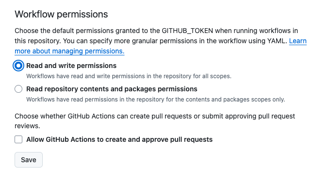

# ExifPR

PRが作成されたタイミングで指定した拡張子のファイルのExif情報を取得し、PRのコメントに記載するGitHub Actionsです。

## How to use

1. レポジトリの`Settings > Actions > General > Workflow permissions`の設定を「Read and write permissions」に変更してください。

2. 以下のようにGitHub Actionsの設定ファイルを作成してください。

```yaml
name: ExifPR

on:
  pull_request:
    types: [opened]

jobs:
  exifpr:
    runs-on: ubuntu-latest

    steps:
    - uses: actions/checkout@v4
    - name: ExifPR
      uses: xryuseix/exifpr@v1.0
      with:
        target_ext: .png .jpeg .jpg .gif .bmp .pdf .mp4 .mp3 .wav
        repository: ${{ github.repository }}
        pr_number: ${{ github.event.pull_request.number }}
      env:
        GITHUB_TOKEN: ${{ secrets.GITHUB_TOKEN }}
```

3. Pull Requestを作成してください。
