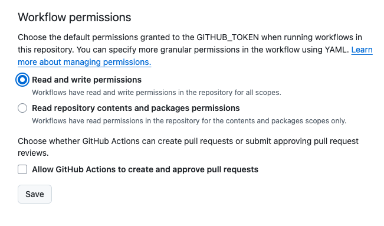

# ExifPR

PR が作成されたタイミングで指定した拡張子のファイルの Exif 情報を取得し、PR のコメントに記載する GitHub Actions です。また、PR comment に `@github exifpr` とコメントしても実行します。

## How to use

1. レポジトリの`Settings > Actions > General > Workflow permissions`の設定を「Read and write permissions」に変更してください。
   
2. [.github/workflows/pr.yaml](./.github/workflows/pr.yaml)のように GitHub Actions の設定ファイルを作成してください。
3. Pull Request を作成またはPRにコメントしてください。
